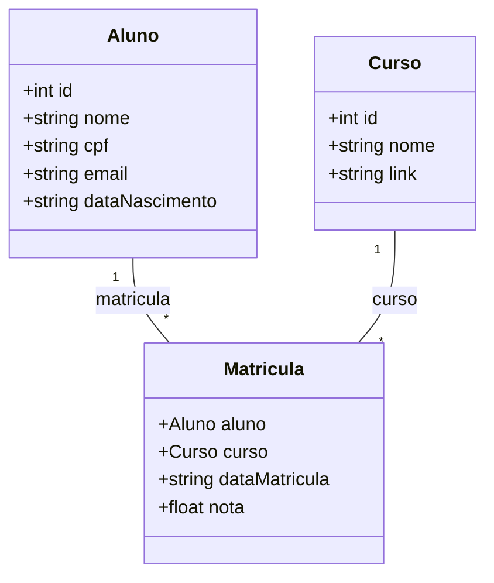

# Desafio API Rest - DIO

## API REST para Gestão de Alunos, Cursos e Matrículas

## 💻 Projeto

Projeto desenvolvido durante o bootcamp GFT - Desenvolvimento JAVA com IA para aplicação dos conceitos de API Rest.
Este projeto é uma API REST desenvolvida em Java utilizando o framework Spring Boot. A aplicação permite gerenciar dados de alunos, cursos e matrículas, oferecendo operações CRUD e consultas.

## 🎯 Funcionalidades

1.  🎓 **Gestão de Alunos**:
  - Cadastrar, listar, atualizar e remover alunos.
2. 📚 **Gestão de Cursos**:
  - Cadastrar, listar, atualizar e remover cursos.
3. 📝 **Gestão de Matrículas**:
  - Matricular alunos em cursos.
  - Listar matrículas com detalhes de alunos e cursos.

## 👨🏻‍💻  Tecnologias Utilizadas

- ☕ **Java 17**
- 🌱 **Spring Boot 3.x**
- 🎲 **Banco de Dados**:
  - 🛠️ H2 Database (para testes e desenvolvimento)
  - 🐘 PostgreSQL (para produção)
- 📖 **Documentação da API**:
  - Swagger/OpenAPI

## Modelagem de Dados

A estrutura de dados segue a modelagem abaixo:



## Pré-requisitos

1. **JDK 17 ou superior**
2. **Maven**
3. **PostgreSQL**


### Configurar Banco de Dados

1. Configure o banco de dados PostgreSQL:
  - Crie um banco de dados com o nome desejado.
  - Atualize o arquivo `application.properties` ou `application.yml` com as credenciais do banco.

### Executar a Aplicação

1. Clone este repositório:
   ```bash
   git clone https://github.com/WagnerLeodoro/api_curso_aluno.git
   ```
2. Navegue até o diretório do projeto:
   ```bash
   cd api_curso_aluno
   ```
3. Compile e execute o projeto:
   ```bash
   mvn spring-boot:run
   ```
4. Acesse a documentação Swagger em:
   ```
   http://localhost:8080/swagger-ui/index.html
   ```

## Endpoints da API

### Alunos 🧑🏻‍🎓
- `GET /api/alunos`: Lista todos os alunos.
- `POST /api/alunos`: Cadastra um novo aluno.
- `PUT /api/alunos/{id}`: Atualiza um aluno existente.
- `DELETE /api/alunos/{id}`: Remove um aluno.

### Cursos 📗
- `GET /api/cursos`: Lista todos os cursos.
- `POST /api/cursos`: Cadastra um novo curso.
- `PUT /api/cursos/{id}`: Atualiza um curso existente.
- `DELETE /api/cursos/{id}`: Remove um curso.

### Matrículas 📋
- `GET /api/matriculas`: Lista todas as matrículas.
- `POST /api/matriculas`: Cria uma nova matrícula.

## Estrutura de Pastas 📁

```plaintext
src/
├── main/
│   ├── java/
│   │   └── com/seuprojeto/
│   │       ├── controller/    # Controladores REST
│   │       ├── model/         # Modelos de Dados
│   │       ├── repository/    # Interfaces de Repositório
│   │       └── service/       # Regras de Negócio
│   └── resources/
│       ├── application.properties  # Configurações da Aplicação
│       └── data.sql  # Dados iniciais (opcional)
└── test/  # Testes Unitários
```

## Licença

Este projeto é licenciado sob a [MIT License](LICENSE).


